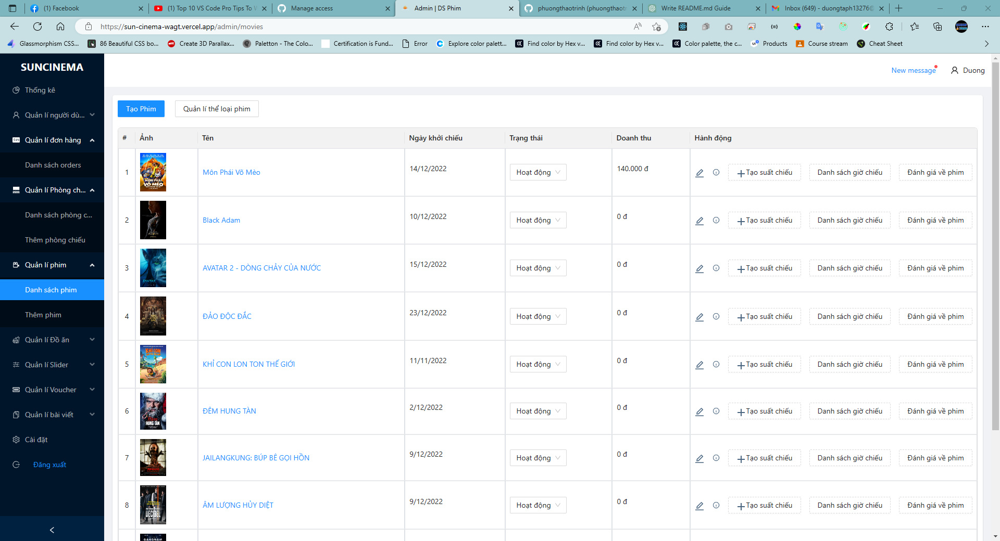

# SUN CINEMA Movie Theater Management

## Introduction
Welcome to Sun Cinema, a movie theater management system designed for my college graduation project. With Sun Cinema, you'll be able to manage movie schedules, ticket sales, and customer information with ease. A user-friendly solution for movie-goers and theater staff alike.

## Preview

   
  <i>Login</i>

   
  <i>Home</i>

   
  <i>Movie Detail</i>

   
  <i>Ticket Booking</i>

   
  <i>Admin</i>

   
  <i>Movie Management</i>

   
  <i>Room Management</i>

## Demo
Website Address: <a href="https://sun-cinema-wagt.vercel.app/">Sun Cinema</a>
Test account: admin@gmail.com
Password:12345678

## Credits
Developed by Team 20:

Front-End Dev: 
* **Trịnh Phương Thảo**
* **Trương Văn Hùng**
* **Tạ Quang Nghĩa**
Back-End Dev:
* **Trần Ánh Dương**
* **Trịnh Minh Tuấn**
* **Bùi Khả Tùng Dương**

Special thanks to our teacher, Mr Nguyễn Đức Anh Tuấn for his support and guidance
